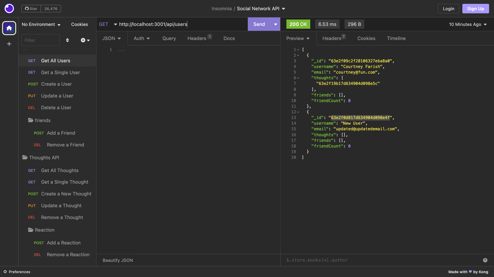
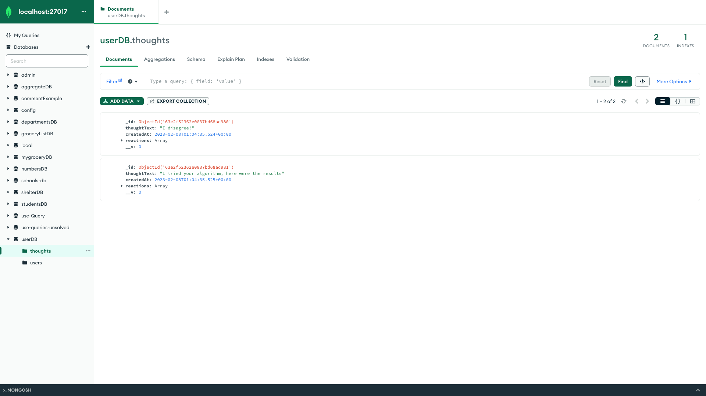

#  [Social-Network-API](https://github.com/Saidou25/Social-Network-API.git)
---

[](https://opensource.org/licenses/MIT)

## Description

This web application is an API for a social network. It allows users to share thoughts.

## Table of Contents

* [Installation](#installation)
* [Technologies](#technologies)
* [Visuals](#visuals)
* [License](#license)
* [Tests](#tests)
* [Questions](#questions)

## Installation

To install necessary dependencies, run the following commands:

- ```npm install``` is necessary to install package.json

- ```npm run seed``` is necessary to properly seed the database

- ```nodemon``` starts the application

## Technologies

```Node.js```

```MongoDB```

```Insomnia```  


## Visuals

"This shows the Get all Thoughts in MongoDB:



You also can view a walkthrough video [Here](https://drive.google.com/file/d/1fdy-E4eFG_1MA6yQya4GnrnmN4x7IcGd/view).

"Showing all Users in Insomnnia:



## License

This project is licensed under the MIT. 
For license notice, please click on the license badge at the top of this readme file or here: [](https://opensource.org/licenses/MIT)


## Tests

N/A

## Questions

If you have any other questions, please contact me: [Sy25](https://github.com/Saidou25)

